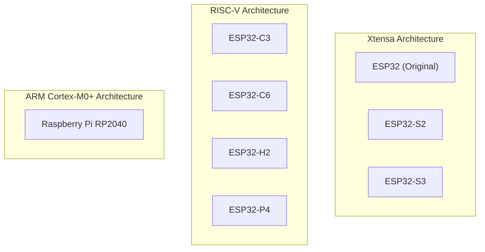

# Target Architectures & Cross-Compilation

This guide explores the multi-CPU embedded compilation pipeline in `nim-esphome`, pointer width alignment, and memory architecture.

---

## Supported Architectures

`nim-esphome` is designed to run on resource-constrained 32-bit microcontrollers supported by ESPHome. It provides first-class support for three primary processor families:

### Auto-Detection Rules
When compiling firmware, `nim-esphome` inspects your ESPHome platform configuration:

| Board Family | Detected Architecture | Nim Compiler Flags |
|---|---|---|
| ESP32, ESP32-S2, ESP32-S3 | Xtensa 32-bit | `--cpu:esp --os:any` |
| ESP32-C3, ESP32-C6, ESP32-H2, ESP32-P4 | RISC-V 32-bit | `--cpu:riscv32 --os:any` |
| Raspberry Pi RP2040 (Pico) | ARM Cortex-M0+ | `--cpu:arm --os:any` |

You can override the auto-detected architecture at any time using `target_cpu:` in your YAML.

---

## 32-bit Microcontroller Pointer Width

On standard desktop platforms (x86_64, Apple Silicon ARM64), pointers and Nim integers (`int`) are 64 bits wide (`sizeof(NI) == 8`).

On microcontrollers (ESP32, RP2040), pointers are 32 bits wide (`sizeof(NI) == 4`). If a compiler transpiles C++ assuming 64-bit word alignment, struct layouts, offsets, and buffer sizing will fail or corrupt memory.

`nim-esphome` guarantees correct 32-bit target pointer widths by passing `--cpu:esp`, `--cpu:riscv32`, or `--cpu:arm` to `nim cpp`. This ensures:
- `int` and `uint` compile to 32-bit integers matching the MCU register width.
- Struct memory padding and ABI alignments match the GCC/Clang embedded cross-compilers used by ESP-IDF and PlatformIO.

---

## Deterministic Memory Management (`--mm:arc`)

Standard desktop runtimes often rely on tracing garbage collectors that pause threads to inspect stacks and heaps. In hard real-time and embedded systems, GC pauses can cause:
- Audio stuttering and buffer underruns during I2S playback.
- Missed GPIO interrupts or sensor bus timing violations.
- Unpredictable memory spikes leading to heap exhaustion.

### Why ARC?
`nim-esphome` configures Nim's deterministic Automatic Reference Counting memory model (`--mm:arc`):
1. **Zero Stop-the-World Pauses**: Memory is freed immediately at the exact instant a variable goes out of scope.
2. **Minimal Footprint**: No background GC threads or scanning routines are compiled into your binary.
3. **FreeRTOS Heap Integration**: By setting `-d:useMalloc`, all dynamic allocations (`seq`, `string`) use standard C `malloc` and `free`, which ESP-IDF routes directly to FreeRTOS's heap allocator.

---

## Exception Handling Without C++ RTTI

By default, ESP-IDF and PlatformIO compile embedded firmware with `-fno-exceptions` and `-fno-rtti` to conserve flash space and RAM.

Standard C++ exception handling (`try/catch/throw`) pulls in `libsupc++`, adding tens of kilobytes of bloat to firmware binaries.

`nim-esphome` configures:
- `--exceptions:goto`: Nim transpiles exception handling into lightweight C jump tables and `goto` statements, completely eliminating the need for C++ exception runtime support.
- `--panics:on`: Fatal errors (such as out-of-bounds array access) abort execution immediately rather than constructing complex stack trace objects.
