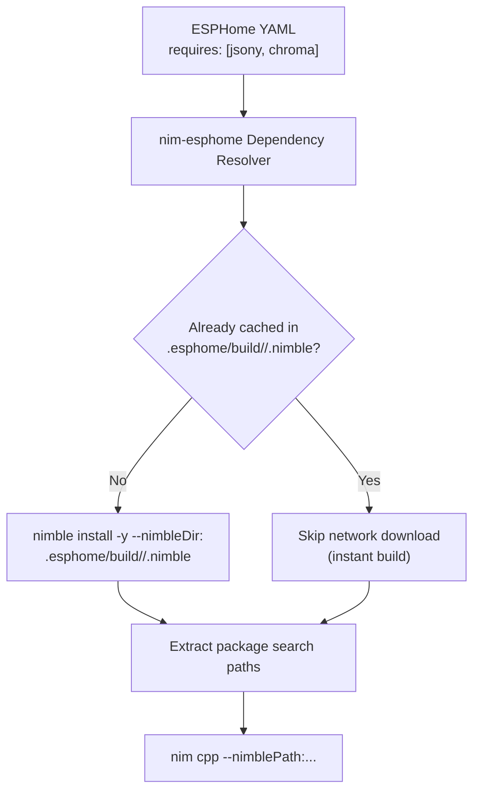

# Automated Nimble Dependencies

This guide explains how `nim-esphome` manages external Nim packages, libraries, and Git dependencies during ESPHome compilation.

---

## The `requires:` Schema

In traditional embedded workflows, managing third-party libraries across diverse development machines requires manual installation steps or messy submodules.

`nim-esphome` introduces first-class automated dependency resolution via the `requires:` key in your ESPHome YAML:

```yaml
nim:
  source: src/main.nim
  requires:
    # 1. Package name from official Nimble package directory
    - chroma

    # 2. Direct Git repository URL
    - https://github.com/treeform/jsony

    # 3. Specific branch, tag, or commit hash
    - https://github.com/nim-lang/zip#v0.3.1
```

---

## Isolated Build Cache Architecture

To prevent polluting your global host environment and avoid permission conflicts during automated Home Assistant builds, `nim-esphome` maintains an isolated Nimble cache:



### Key Advantages:

1. **Zero Host Contamination**: Packages are installed strictly inside the `.esphome/build/<node>/.nimble` directory of the target device.
2. **Deterministic Builds**: Each ESPHome node maintains its own independent package versions.
3. **Offline Caching**: Once downloaded, subsequent builds reuse the cached packages without requiring internet connectivity.
4. **Clean Builds**: Running `esphome clean <device>.yaml` purges the node's local cache if you need a fresh rebuild.

---

## Local Package Paths (`nimble_paths:`)

If you are developing custom Nim libraries locally alongside your firmware, you can specify them using `nimble_paths:`:

```yaml
nim:
  source: src/main.nim
  nimble_paths:
    - ../shared_firmware_libs/src
    - /Users/username/Development/my_dsp_filters/src
```

These paths are passed directly to `nim cpp` as `--path:...` search flags, allowing you to `import` your modules directly.
