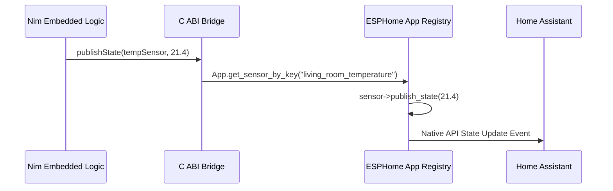

# First-Class Entity Bindings & Home Assistant

This guide explains how to interact with ESPHome sensors, binary sensors, switches, and text sensors directly from Nim, and how updates propagate to Home Assistant.

---

## Entity Types Overview

`nim_esphome/entities` provides type-safe object handles corresponding to standard ESPHome entity platforms:

| Nim Handle Type | ESPHome Platform | State Type | Typical Uses |
|---|---|---|---|
| `Sensor` | `sensor:` | `float32` | Temperature, humidity, power, battery voltage, signal strength |
| `BinarySensor` | `binary_sensor:` | `bool` | PIR motion sensors, reed door contacts, water leak detectors |
| `Switch` | `switch:` | `bool` | Power relays, output toggles, operational mode flags |
| `TextSensor` | `text_sensor:` | `string` | State machine names, error logs, firmware build metadata |

---

## Publishing State

You instantiate entity handles using their string IDs as defined in your ESPHome YAML:

```nim
import nim_esphome

# Create handles matching your YAML entity IDs
let
  tempSensor = newSensor("living_room_temperature")
  motionDetector = newBinarySensor("front_door_motion")
  lightSwitch = newSwitch("porch_light")
  statusMessage = newTextSensor("device_status")

esphomeSetup:
  info("Main", "Publishing initial entity states...")
  statusMessage.publishState("System Initialized")

esphomeLoop:
  # Publish sensor readings
  tempSensor.publishState(21.4'f32)
  motionDetector.publishState(false)
  lightSwitch.publishState(true)
```

---

## How It Works Under the Hood



1. **Embedded Mode (`-d:esphome`)**:
   - `publishState` calls the C ABI helper `esphome_nim_publish_sensor(...)`.
   - The helper queries ESPHome's internal `App` singleton to look up the component pointer matching the string ID.
   - It invokes the component's native `publish_state(...)` method.
   - ESPHome's Native API immediately pushes the new state to Home Assistant over the encrypted TCP connection.

2. **Host Test Mode (Local machine without hardware)**:
   - When compiled natively (`nim c -r tests/test_entities.nim`), the bindings write into an in-memory test table.
   - You can verify your logic using `getSensorState()`, `getBinarySensorState()`, `getSwitchState()`, and `getTextSensorState()`.

---

## Example ESPHome YAML

Here is a matching ESPHome YAML configuration demonstrating template entities published by Nim:

```yaml
sensor:
  - platform: template
    id: living_room_temperature
    name: "Living Room Temperature"
    unit_of_measurement: "°C"
    accuracy_decimals: 1

binary_sensor:
  - platform: template
    id: front_door_motion
    name: "Front Door Motion"
    device_class: motion

switch:
  - platform: template
    id: porch_light
    name: "Porch Light"
    optimistic: true

text_sensor:
  - platform: template
    id: device_status
    name: "Device Status"
```
