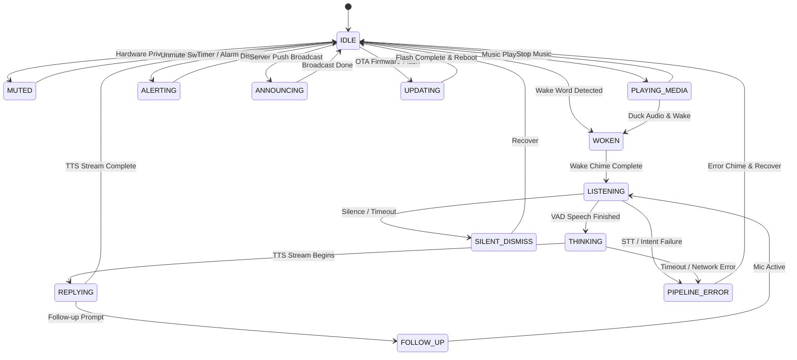

# Case Study: Verified Voice Satellites (esphome-satellite)

This case study demonstrates how `nim-esphome` powers **[`esphome-satellite`](https://github.com/axiomantic/esphome-satellite)**—a compile-time verified voice satellite state machine for ESPHome and Home Assistant.

---

## The Problem with Traditional Voice Satellites

In conventional smart home voice satellites, firmware state is typically distributed across asynchronous network events, Home Assistant websocket callbacks, and ad-hoc C++ variables in YAML lambdas.

This loose architecture leads to well-known race conditions:
1. **Premature Chime Clipping**: Audio playback starts before hardware I2S amplifiers or DACs wake up.
2. **Stop Word Race Conditions**: Saying *"Stop"* while the assistant is replying can get clobbered by an in-flight TTS chunk.
3. **Audio Ducking Failures**: Background music fails to duck or un-duck properly when wake words trigger.
4. **Offline & OTA Phantom Triggers**: Microphones continue capturing audio and triggering pipelines even during firmware OTA updates or when Home Assistant is disconnected.

---

## The Typestate Solution

`esphome-satellite` eliminates these bugs entirely by implementing a formal **14-state typestate Finite State Machine (FSM)** in Nim using `nim-esphome` and the `typestates` package.

With typestates, states are represented as unique compile-time types. State transitions are defined as type transformations. If code attempts an illegal transition (such as triggering a wake word while in the `Muted` or `Updating` state), the Nim compiler rejects the build at compile time!



---

## The 14 Verified Lifecycle States

1. **`IDLE`**: Ready and waiting for wake words or server commands.
2. **`WOKEN`**: Wake word recognized; playing acknowledgement chime and ducking background media.
3. **`LISTENING`**: Microphone streaming audio to Home Assistant voice pipeline.
4. **`THINKING`**: Speech capture finished; waiting for speech-to-text (STT) and LLM intent execution.
5. **`REPLYING`**: Streaming and playing text-to-speech (TTS) audio response.
6. **`FOLLOW_UP`**: Interactive multi-turn dialogue; keeping the session open for immediate follow-up commands.
7. **`SILENT_DISMISS`**: Graceful, silent exit when wake word was triggered by accident with no subsequent speech.
8. **`PIPELINE_ERROR`**: Deterministic error handling for network timeouts or intent recognition failures.
9. **`CONNECTION_ERROR`**: Safe degraded mode when Home Assistant is unreachable; blocks wake words to prevent dead ends.
10. **`MUTED`**: Hardware privacy mode; microphone capture is completely inhibited.
11. **`PLAYING_MEDIA`**: Streaming background music or podcasts; automatically ducks audio on wake word.
12. **`ALERTING`**: Active timer or alarm alert sounding; can be silenced with a quick stop word.
13. **`ANNOUNCING`**: Server-initiated announcement broadcast (e.g. doorbell chime or security alert).
14. **`UPDATING`**: Over-The-Air (OTA) firmware flashing in progress; all audio, sensors, and wake words are strictly locked.

---

## Complete Verification via Host Tests

Because `esphome-satellite` is written in Nim using `nim-esphome`, its entire 14-state lifecycle is covered by comprehensive unit tests that run instantly on macOS and Linux host machines:

```bash
cd esphome-satellite
./scripts/build.sh
```

All 21 integration test suites—including happy paths, stop word interrupts, silence dismissals, audio ducking cycles, and compile-time rejection of illegal transitions—run in under a second without flashing hardware!
